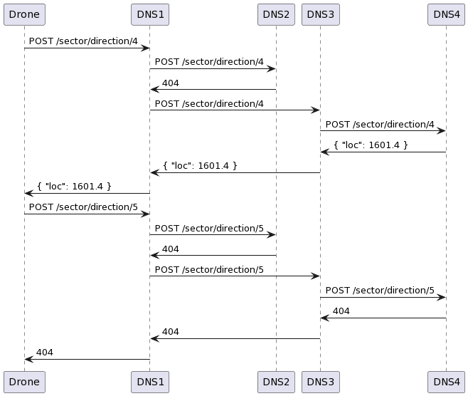

# Drone Navigation System (DNS)

## Abstract
The universe is split into sectors. There are DNS in each one. Drones drift between sectors and gather data. Having enough data gathered the drones need to find a way to a databank. Boolet points
* Each sector has a unique **sectorId** (constant)
* Each sector has at least one DNS deployed
* Each sector has different number of drones deployed at any given moment
* Drones communicate using JSON RESAT API
* DNS request example: `{
  "x": "123.1",
  "y": "123.2",
  "z": "123.3",
  "vel": "123.0"
  }`

## Assumptions
* Each drone in a sector knows the addresses of deployed DNSs in that sector
* Each DNS knows the addresses of its neighbor-DNSs (called allies)
* The DNSs create GSM-like cellular network

## Analysis
Each DNS is only aware of its **sectorId**. Each DNS knows a databank location in the same sector. Each DNS knows the addresses of its allies, but can't calculate the location of ally databank (because it doesn't know the **sectorId**s of its allies). We can perceive the network of DNSs as an oriented graph. In the figure:


* DNS1 knows the addresses of DNS2 and DNS3
* DNS2 knows the addresses of DNS1 and DNS3
* DNS3 knows the addresses of DNS1, DNS2 and DNS4
* DNS4 know the address of DNS3

## Solution
We implement DNS as a microservice. The microservice has a single endpoint `/sector/direction/:id` where `:id` is a **sectorId**. The endpoint receives POST request with the body described earlier. If the DNS doesn't know the location of the databank in the sector (:id differed from the **sectorId** the DNS resides), it asks its allies. If the queried DNS and none of its allies can calculate the location, the DNS returns 404. The figure illustrates this process.



## Deploy
* `docker build - dns .` - to build an image
* `docker run -p 8080:8080 --name sample-dns dns` - to run a DNS instance on port `8080`

The next arguments could be changed using `--build-arg` parameter:
* `DNS_CONFIG_ARGUMENT` path to the dns configuration file
* `PORT` port to expose

## Configuration format
```
sectorId: 1
address: "0.0.0.0:8080"
allies:
- "http://0.0.0.0:8082"
- "http://0.0.0.0:8083"
```
* `sectorId` - the **sectorId** the DNS resides in
* `address` - the address if the DNS
* `allies` - the list of the DNS allies

## Testing
* `docker-compose up` sets up the topology described in the [figure](topology.png) and runs tests for DNS1
* set `DNS_CONFIG` environment variable to run and debug tests locally

## QA

_Q: What instrumentation this service would need to ensure its observability and operational transparency?_

* Logs
* Metrics (CPU, RAM, Network....)
* Service mesh

_Q: Why throttling is useful (if it is)? How would you implement it here?_

Throttling allows us to keep matching up to SLA during a service in high demand.

I would use a load balancer to implement throttling. The load balancer would cache the drone's ID (could be IP or anything else). Before routing the request to a DNS instance the load balancer would check if the drone has already queried the DNS recently. If so, the load balancer would reject the query. If the load balancer is not an option in the future, I would implement the caching logic as a part od DNS. 

_Q: What we have to change to make DNS be able to service several sectors at the same time?_

Change **sectorId** type from _int_ to _List_. 

_Q: Our CEO wants to establish B2B integration with Mom's Friendly Robot Company by
allowing cargo ships of MomCorp to use DNS. The only issue is - MomCorp software
expects loc value in location field, but math stays the same. How would you
approach this? What’s would be your implementation strategy?_

I would implement a middleware that converts the response body. To distinguish MomCorp drones from the others, the MomCorp ones could send some kind of JWT token.

_Q: Atlas Corp mathematicians made another breakthrough and now our navigation math is
even better and more accurate, so we started producing a new drone model, based on
new math. How would you enable scenario where DNS can serve both types of clients?_

I would implement an API versioning. E.g. `/v1/sector/direction/:id` has a default behaviour; `/v2/sector/direction/:id` has new behaviour. I would also redirect `/sector/direction/:id` to `/v1/sector/direction/:id` (http 301 status code)

_Q: In general, how would you separate technical decision to deploy something from
business decision to release something? (How can engineering team deploy changes to production without an explicit public release?)_

We could deploy a new feature using CI/CD pipeline. I would go for the _rolling deployment_ strategy
https://docs.aws.amazon.com/whitepapers/latest/overview-deployment-options/rolling-deployments.html
